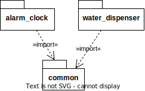

# Folder for the boards firmware

## Baud Rate

The baud rate should be set to 115200, because the board outputs some information on boot, which is not readable with a lower baud rate.

## Architecture

Both alarm_clock and water_dispenser import a shared project `common`. It is required because both alarm_clock and water_dispenser run on different boards, but both may need data to send to Lorawan or connect to WIFI. By having a common library, we prevent code duplication.